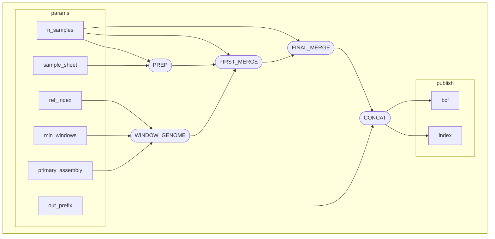

# nf-bcftools-par-merge
Parallelized bcftools merge in Nextflow for large datasets (>1,000 samples). Speed up over a naive `bcftools merge` is proportional to the number of samples & size of VCFs. Work in progress, initially developed for merging tumor WGS VCFs from GDC. Edit sample sheet parsing and the PREP process to adapt for other datasets.

**DAG**

